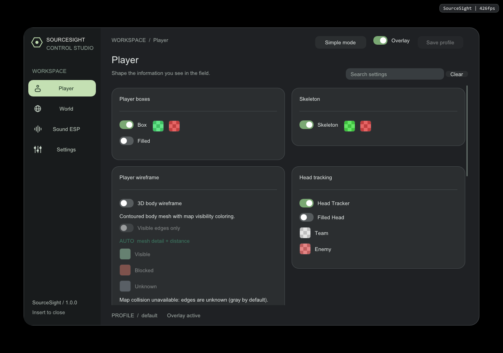

# SourceSight Windows

A standalone Windows x64 version of SourceSight, maintained by **corund207**.
Based on the Linux source at `4088b863d11f4ed2f607d7e8fe66d7b53dee686b`.
This repository has its own Windows build, tests, packaging and commit history.



The graphite menu, player overlays, radar, sound visualization, bullet trails,
player/viewmodel wireframes, GPU full-map rendering, profiles and diagnostics
are retained. Aim, triggerbot, spinbot, quick-switch macros, input drivers and
their configuration/UI are removed. Process access uses Windows user-mode
read APIs; there is no game-memory write or input-injection implementation.

## Build

Requires Windows 10/11 x64, Git, CMake 3.24+ and a C++20 compiler with
`std::format`. Use Visual Studio 2022 Build Tools with Desktop development
with C++, or a current w64devkit GCC toolchain. The first configure downloads
the pinned GLEW source; other dependencies are pinned Git submodules.

```powershell
git clone --recurse-submodules https://github.com/corund207/sourcesight-windows.git
cd sourcesight-windows
cmake -S . -B build -A x64
cmake --build build --config Release --parallel 4
ctest --test-dir build -C Release --output-on-failure
```

For w64devkit, run these from its shell, with CMake available:

```sh
cmake -S . -B build -G "MinGW Makefiles" -DCMAKE_BUILD_TYPE=Release
cmake --build build --parallel 4
ctest --test-dir build --output-on-failure
```

The binary is `build/Release/sourcesight.exe` with Visual Studio, or
`build/sourcesight.exe` with MinGW. Static dependencies are linked into the
application. Rendering requires an OpenGL 3.3 capable graphics driver.

## Run

Start CS2 in windowed or borderless mode, then start `sourcesight.exe`.
The app waits briefly for `cs2.exe`, uses its client area for the overlay,
hides when another app has focus, and closes when the game exits.
Empty overlay pixels are transparent. The native window includes one transparent
padding column to keep Windows desktop composition active on borderless monitors;
rendering coordinates still match the game's client area. Full-screen blackout
is removed, including legacy profile settings. The menu and status watermark
only appear while the menu is open; no startup help panel covers the game.

**Insert** opens/closes the menu. **F9** disables the overlay. **End** saves
the active profile and exits. Closing the menu also saves the profile.
With the menu closed, mouse input passes through to the game and the overlay
does not take keyboard focus when it reappears after switching applications.
While CS2 shows its mouse cursor (buy menu, settings and other game menus),
ESP temporarily hides so those menus remain clickable. It returns when gameplay
captures the cursor. SourceSight's own menu stays visible when opened with Insert.
Profiles are stored under `configs/` in the working directory. Writes use
flushed temporary files and Windows atomic replacement with a `.json.bak`
backup. Linux visual profiles can be imported; automation sections are stripped.

Try the interface without CS2 or process attachment:

```powershell
.\build\sourcesight.exe --preview
# Automatically close after a short rendering smoke check:
.\build\sourcesight.exe --preview --frames 12
```

Preview disables profile, capture and diagnostic export actions. It displays
empty game data. It does not simulate a match.

## Windows game layout

The checked-in read layout comes from the Windows output of
[a2x/cs2-dumper](https://github.com/a2x/cs2-dumper/tree/c46bfec6ac83b34fea4ce85383d9f0d555e96b38),
for **CS2 build 14185**. Startup rejects a different build rather than using
incompatible offsets. After a game update, obtain a matching Windows dump and
regenerate the header from its full commit SHA (Node.js 20+ required):

```powershell
node tools/update-offsets.mjs <40-character-commit-sha>
cmake --build build --config Release --parallel 4
```

The upstream snapshot is not proof of compatibility with every installation.
Live in-game alignment and entity reads have not been verified for this port.
Map-name lookup is best-effort because global-variable layout is outside the
schema dump. An unavailable map name disables geometry-dependent features while
other readable player data remains available. Restart after restarting CS2.

## Maps and capture

Place locally obtained `maps/<map-name>.tri` beside the executable or in the
working directory. Each triangle is nine little-endian floats (36 bytes), with
no header. Map files are validated and loaded in the background. Compatible
local `.vphys` files can be converted with the included `VPhysToOpt.exe`.
Compressed game assets may need a separate extraction tool. Steam discovery
uses the Windows registry and `libraryfolders.vdf`, including custom libraries.
Game-derived map files are excluded from Git and packages.

Screenshots use Windows GDI and save BMP files. Video recording requires
`ffmpeg.exe` on PATH and captures the desktop to MP4. The recorder starts
directly without a command shell and receives `q` to finalize the video.
Windows capture exclusion is enabled by default; disable **Streamproof** if
you want the overlay to appear in recordings/screenshots. Capture records the
desktop, not just CS2.

## Validation and packaging

CTest includes profile recovery, cache lifecycle, four-tab menu interactions,
radar calibration, synthetic geometry/visibility, actual OpenGL framebuffer
pixels, Windows process reads/file replacement, legacy-profile removal, and
the app's offline preview. A desktop composition regression checks that empty
pixels reveal a colored window underneath while overlay graphics remain visible,
including mouse hit testing, menu clickthrough toggles and focus preservation.
Tests do not attach to CS2. Framebuffer,
desktop composition and preview checks require OpenGL 3.3; hosted CI runs the
remaining checks because hosted
Windows machines may only provide OpenGL 1.1.

```powershell
powershell -NoProfile -File scripts/package-release.ps1 -BuildDir build -Configuration Release
```

This creates `dist/sourcesight-windows-v1.0.0-x64.zip` with executables,
documentation and dependency licenses. Personal profiles, maps, captures,
logs and development tools are excluded.

SourceSight is not affiliated with Valve. Original SourceSight material retains
the proprietary terms in [LICENSE](LICENSE); third-party components retain their
own terms in [THIRD_PARTY_NOTICES.md](THIRD_PARTY_NOTICES.md).
